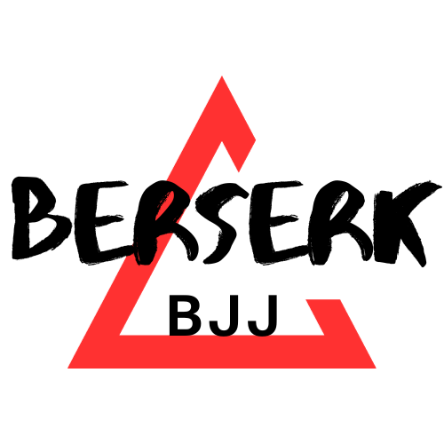

# BerserkBJJ E-commerce Store

  

The **BerserkBJJ E-commerce Store** is a web application built with **Flask** and **Python** using **Jinja** templating. It serves as a front-end focused e-commerce store designed to showcase and manage products for Brazilian Jiu-Jitsu (BJJ) enthusiasts. While the application has a simple backend structure to handle order data, most of the product information is handled in the front end.

This project was created for educational purposes, focusing on using Flask to combine front-end and back-end elements for a functional web application.

## Table of Contents

- [About the Project](#about-the-project)
- [Features](#features)
- [Technical Overview](#technical-overview)
- [Contact](#contact)

## About the Project

The BerserkBJJ E-commerce Store allows users to view various BJJ products, such as kimonos, rash guards, and accessories. While there is some backend functionality, it is limited to logging order details rather than fully processing transactions.

Products displayed on the front end are defined directly in `models.py`, instead of being stored in a separate backend database. The Flask framework and **Jinja** templating are used to dynamically render product information into HTML templates for a smooth user experience.

## Features

### Front End

The front end of BerserkBJJ is built using **Flask** and **Jinja** templating, which dynamically renders product information from `models.py` into HTML pages. Key front-end features include:

- **Dynamic Product Display**: Products defined in `models.py` are rendered into HTML templates via Jinja, generating product listings and detail views.
- **Bootstrap Integration**: Responsive layouts and styling are achieved with Bootstrap, providing a clean and user-friendly interface.
- **Order Form**: The checkout page includes a form where users can enter their information, which is then submitted to the back end.

### Back End

The back end is developed with Flask, including minimal database functionality to handle order data. While primarily focused on front-end functionality, the back end provides:

- **Database Models**: The `Product` and `Order` models in `models.py` define the structure of the data.
  - **Product**: Contains details about each product (name, image, type, cost, description).
  - **Order**: Stores user-submitted details when an order is placed, including name, contact information, and shipping address.
- **Routing**: 
  - `@bp.route('/')`: Fetches all products and renders the home page (`index.html`).
  - `@bp.route('/product/<int:productid>/')`: Fetches details for a specific product and renders `product.html`.
  - `@bp.route('/checkout')`: Handles form submissions for order checkout, validating and saving order details to the database.
- **Database Storage**: The order details are saved in an SQLite database using SQLAlchemy, a Flask-supported ORM (Object-Relational Mapper) that translates Python objects to SQL commands.

## Technical Overview

- **Front End**:
  - **HTML Templates**: Located in the `templates` folder, these files use Jinja templating to render product data dynamically. For example, `index.html` lists all products, while `product.html` displays details of a selected product.
  - **Jinja Templating**: Inserts product information into HTML templates, allowing dynamic content to be displayed based on database queries.
  
- **Back End**:
  - **Flask and SQLAlchemy**: Flask handles routing and request management, while SQLAlchemy manages database interactions. Product and order information is structured through models in `models.py`.
  - **SQLite Database**: Used to store order details. The database schema is managed through the models in `models.py`, which SQLAlchemy uses to create and maintain the database.
  - **Minimal Order Handling**: While there is no payment processing, the application captures customer information and order details, simulating part of an e-commerce workflow.

## Contact

For more information, feel free to reach out to me at [jaydhorvat@gmail.com](mailto:jaydhorvat@gmail.com) or visit [my portfolio website](https://jay-horvat.github.io/) for additional background, experience, and alternative contact options.
